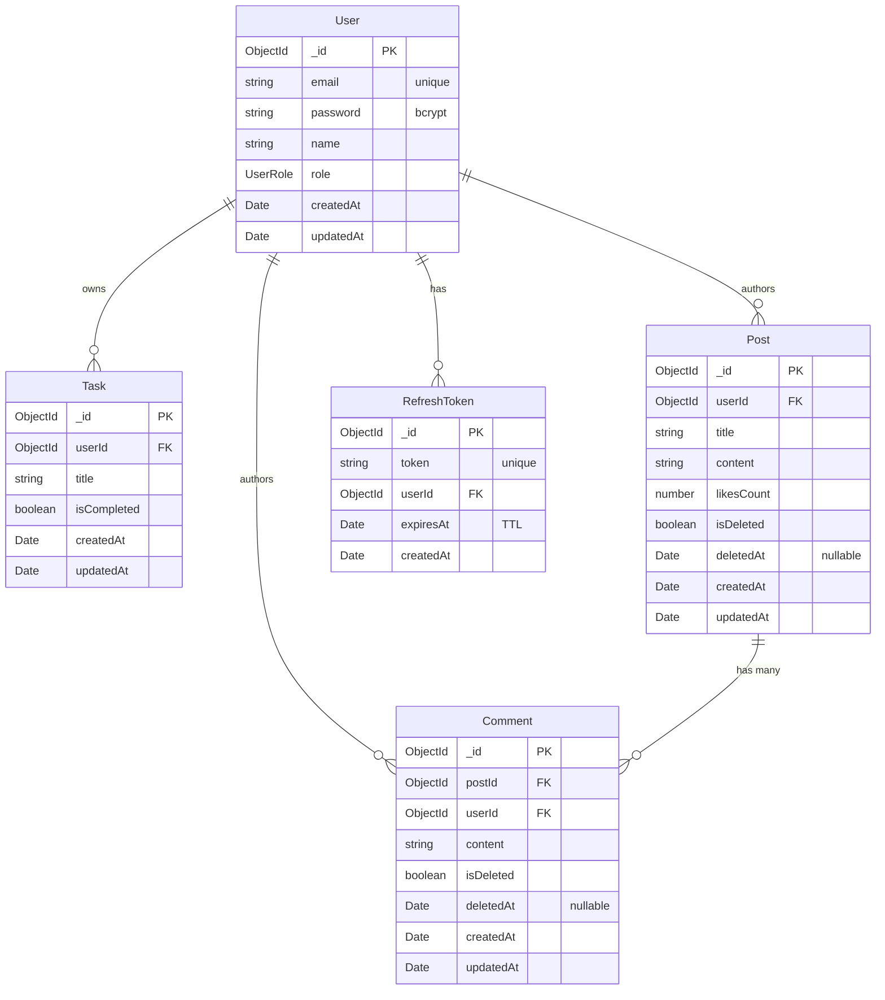

[](https://github.com/nadavramon/server/actions/workflows/ci.yml)

# server

A TypeScript + Express REST API with JWT auth and MongoDB persistence via Mongoose. Manages users, tasks, and a blog system (posts, comments, likes) with soft-delete support.

## Tech stack

- **Node.js** ≥ 24 (`tsx` for dev, `tsc` for production builds)
- **Express 5** for HTTP routing
- **Mongoose 9** for all data access (users, tasks, posts, comments, refresh tokens)
- **JWT** access + refresh tokens; refresh tokens persisted with a TTL index for auto-cleanup
- **Zod** for request DTO validation
- **Vitest** for tests

## Getting started

### Prerequisites

- Node.js 24+
- A running MongoDB instance (local or remote)

### Setup

```bash
npm install
cp .env.example .env/.env.dev   # then fill in real values
npm run dev
```

The server boots on `http://localhost:3000`. Hit `GET /health` to confirm it's up. Swagger UI is at `/api-docs`.

### Environment variables

See [.env.example](./.env.example). All four are required.

| Variable               | Purpose                        |
| ---------------------- | ------------------------------ |
| `PORT`                 | HTTP port                      |
| `JWT_SECRET`           | Signing key for access tokens  |
| `REFRESH_TOKEN_SECRET` | Signing key for refresh tokens |
| `MONGODB_URI`          | Mongo connection string        |

## Scripts

| Command                | What it does                       |
| ---------------------- | ---------------------------------- |
| `npm run dev`          | Start with hot-reload (tsx watch)  |
| `npm run build`        | Compile to `dist/`                 |
| `npm start`            | Run compiled output                |
| `npm run start:prod`   | Run compiled output with .env.prod |
| `npm run typecheck`    | `tsc --noEmit`                     |
| `npm test`             | Vitest run                         |
| `npm run test:watch`   | Vitest watch mode                  |
| `npm run format`       | Prettier write                     |
| `npm run format:check` | Prettier check (CI)                |

## Project structure

```
src/
  app.ts                   # Express app + middleware + routes
  index.ts                 # boot + graceful shutdown
  modules/
    auth/                  # register, login, refresh, logout
    user/                  # users
    task/                  # tasks (todos)
    post/                  # blog posts (CRUD + like, soft-delete)
    comment/               # comments on posts (CRUD, soft-delete with cascade)
  shared/
    config/                # env loader, Mongoose connection
    middlewares/           # auth, rate limiter, error handler, http logger
    errors/                # AppError hierarchy
    utils/                 # logger, swagger, validate
    types/                 # Express type augmentation
db/
  queries.mongodb          # Studio 3T IntelliShell snippets
```

Each `modules/<name>/` folder follows the same layout: `<name>.ts` (domain types), `<name>Schema.ts` (Mongoose schema), `<name>Model.ts` (async data access + mapper), `<name>Service.ts` (business logic), `<name>Controller.ts` (HTTP handlers), `<name>Routes.ts` (route wiring), `<name>.dto.ts` (Zod request shapes).

## Data model



### Relationships

| Direction             | FK field | Cardinality         | Notes                                               |
| --------------------- | -------- | ------------------- | --------------------------------------------------- |
| `Task → User`         | `userId` | 1 user : N tasks    | Tasks are private — only the owner sees them        |
| `Post → User`         | `userId` | 1 user : N posts    | Author                                              |
| `Comment → User`      | `userId` | 1 user : N comments | Author                                              |
| `Comment → Post`      | `postId` | 1 post : N comments | Comments cascade-soft-delete with their parent post |
| `RefreshToken → User` | `userId` | 1 user : N tokens   | Multiple active sessions per user                   |

### Indexes

| Collection     | Index                                             | Purpose                                                |
| -------------- | ------------------------------------------------- | ------------------------------------------------------ |
| `Comment`      | `{ postId: 1, createdAt: -1 }` (compound)         | Serves "newest comments per post" via index scan       |
| `RefreshToken` | `{ token: 1 }` (unique)                           | Prevents duplicate tokens, fast lookup by token        |
| `RefreshToken` | `{ expiresAt: 1 }` (TTL, `expireAfterSeconds: 0`) | Mongo's background sweeper auto-deletes expired tokens |

### Soft-delete model

`Post` and `Comment` use a two-field soft-delete pattern:

- `isDeleted: boolean` (default `false`) — the source of truth for visibility. All reads filter `{ isDeleted: false }` explicitly.
- `deletedAt: Date | null` (default `null`) — audit timestamp, set when the document is soft-deleted.

When a `Post` is soft-deleted, `postService.deletePost` also runs `commentModel.softRemoveByPostId` — `updateMany` on all live comments under that post, in one batched operation. Both layers hide together, no orphans.

`User`, `Task`, and `RefreshToken` use **hard-delete** (no soft-delete fields).
